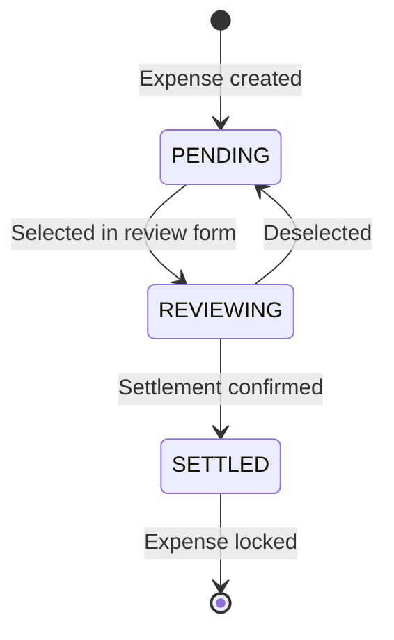

# Settlement Patterns

Architecture patterns specific to Epic 3: Monthly Settlement.
These patterns extend the core architecture for settlement-specific concerns.

## Overview

Settlements represent a monthly reconciliation between two partners where unsettled
expenses are reviewed, approved, and locked. The settlement flow is:

1. **Review**: Partners see all unsettled expenses and select which to include
2. **Confirm**: System calculates totals and transfer direction, partners review
3. **Settle**: Atomic creation locks expenses and creates settlement record

## Settlement State Machine

### States

| State | Description | Transition Trigger |
| --- | --- | --- |
| **PENDING** | Expense created, not yet in any settlement | Auto (initial state) |
| **REVIEWING** | Expense selected in settlement review form | UI state only (no DB change) |
| **SETTLED** | Expense included in confirmed settlement | `settlement_id` assigned by adapter |

### State Transitions



**Key Design Decision**: Only the SETTLED state persists to database. REVIEWING is pure
UI state held in form checkboxes. This keeps the design simple (no draft settlement records)
while supporting the 2-person use case.

## Soft Immutability Enforcement

### Why Soft (Not Hard) Constraints

Hard database constraints (triggers or check constraints) preventing edits to settled
expenses would:

- Prevent admin override for corrections
- Add complexity to schema
- Require complex constraint management

Instead, we use **application-layer enforcement**:

### Enforcement Points

1. **Use Case Level** (primary enforcement)

```python
# use_cases/expenses.py
def update_expense(
    uow: UnitOfWork, expense_id: int, actor_id: int, **kwargs
):
    expense = uow.expenses.get_by_id(expense_id)
    if expense.settlement_id is not None:
        raise ExpenseAlreadySettledError(expense_id)
    # ... proceed with update
```

1. **UI Level** (user experience)

- Disable edit/delete buttons for settled expenses
- Show "Settled" badge in expense lists
- Return 400 error with message if somehow triggered

1. **Audit Trail** (accountability)

- All edits logged with before/after state
- Admin can identify who modified settled expense

### Error Handling

```python
# domain/errors.py
class ExpenseAlreadySettledError(DomainError):
    """Raised when attempting to modify an expense already in a settlement."""

    def __init__(self, expense_id: int):
        self.expense_id = expense_id
        super().__init__(
            f"Expense {expense_id} is already settled and cannot be modified"
        )

# web/settlements.py exception handler
DOMAIN_ERROR_MAP = {
    ExpenseAlreadySettledError: status.HTTP_400_BAD_REQUEST,
    # ... other errors
}
```

## Reference ID Generation

### Format

Human-readable: `{Month} {Year}` (e.g., "March 2025")

### Generation Logic

```python
# domain/use_cases/settlements.py
def generate_settlement_reference(
    settlement_date: date | None = None
) -> str:
    """Generate human-readable settlement reference.

    Format: 'March 2025', 'December 2024', etc.
    """
    if settlement_date is None:
        settlement_date = date.today()

    month_name = settlement_date.strftime("%B")  # Full month name
    year = settlement_date.year
    return f"{month_name} {year}"
```

### Uniqueness Constraints

- **Database**: `UNIQUE(group_id, reference)`
- **Application**: Check for existing settlement before creation
- **Race condition**: DB constraint catches concurrent creation attempts

```python
# settlement_adapter.py
def create(
    self,
    reference: str,
    group_id: int,
    actor_id: int,
) -> Settlement:
    try:
        row = SettlementRow(
            reference=reference,
            group_id=group_id,
            # ... other fields
        )
        self._session.add(row)
        self._session.flush()  # Trigger constraint check
        return self._to_public(row)
    except IntegrityError as e:
        if "settlements_group_id_reference_key" in str(e):
            raise DuplicateSettlementError(reference, group_id)
        raise
```

## Transfer Direction Calculation

### Business Logic

Transfer direction determines who pays whom to settle the balance.

```python
# domain/splits.py
from decimal import Decimal
from dataclasses import dataclass

@dataclass
class TransferDirection:
    from_user: int | None
    to_user: int | None
    amount: Decimal

def calculate_settlement_transfer(
    user1_id: int,
    user2_id: int,
    user1_balance: Decimal,  # Positive = owes money
    user2_balance: Decimal,  # Positive = owes money
) -> TransferDirection:
    """Calculate who should pay whom to settle balances.

    In a 2-person group, balances should be roughly inverse:
    - If user1 owes $100, user2 should be owed $100
    - But actual values may differ due to rounding

    Returns TransferDirection indicating payment flow.
    """
    # Validate: total should be ~0 (allowing for rounding errors)
    total = user1_balance + user2_balance
    assert abs(total) < Decimal("0.01"), f"Balances don't balance: {total}"

    if user1_balance > 0 and user2_balance < 0:
        # User1 owes money, pays user2
        return TransferDirection(
            from_user=user1_id,
            to_user=user2_id,
            amount=user1_balance
        )
    elif user2_balance > 0 and user1_balance < 0:
        # User2 owes money, pays user1
        return TransferDirection(
            from_user=user2_id,
            to_user=user1_id,
            amount=user2_balance
        )
    else:
        # No transfer needed (balanced to 0)
        return TransferDirection(
            from_user=None,
            to_user=None,
            amount=Decimal("0")
        )
```

### Display Logic

```python
# templates/settlements/confirm.html logic
direction = calculate_settlement_transfer(
    user1_id, user2_id, balance1, balance2
)

if direction.from_user is None:
    message = "No payment needed - balances are even"
elif direction.from_user == current_user_id:
    message = f"You pay {other_user_name} ${direction.amount}"
else:
    message = f"{other_user_name} pays you ${direction.amount}"
```

## Stateless Review Flow

### Why Stateless?

For a 2-person settlement app, draft persistence adds complexity without benefit:

- Partners typically settle together in one session
- No need for "save draft and return later"
- Simpler code: no draft state machine, no cleanup jobs

### Flow Implementation

#### Step 1: Review (GET /settlements/review)

```python
# web/settlements.py
@router.get("/settlements/review")
async def review_settlement(
    request: Request,
    user_id: CurrentUserId,
    uow: UowDep,
):
    with uow:
        expenses = uow.queries.list_unsettled_expenses(
            group_id=get_group_id_for_user(user_id)
        )

    return templates.TemplateResponse(
        "settlements/review.html",
        {"request": request, "expenses": expenses}
    )
```

Template (settlements/review.html):

```html
<form method="post" action="/settlements/confirm">
  <table>
    
    <tr>
      <td>
        <input type="checkbox"
               name="expense_ids"
               value="{{ expense.id }}"
               checked>  <!-- Default to all selected -->
      </td>
      <td>{{ expense.date }}</td>
      <td>{{ expense.description }}</td>
      <td>${{ expense.amount }}</td>
    </tr>
    
  </table>
  <button type="submit">Review Selected</button>
</form>
```

#### Step 2: Confirm (GET /settlements/confirm)

```python
# web/settlements.py
@router.get("/settlements/confirm")
async def confirm_settlement(
    request: Request,
    expense_ids: list[int] = Query(...),
    user_id: CurrentUserId,
    uow: UowDep,
):
    with uow:
        expenses = uow.expenses.get_for_settlement(expense_ids)
        # Validate all still unsettled
        for exp in expenses:
            if exp.settlement_id is not None:
                raise ExpenseAlreadySettledError(exp.id)

        # Calculate totals
        total = sum(exp.amount for exp in expenses)
        direction = calculate_transfer_direction(expenses, user_id)

    return templates.TemplateResponse(
        "settlements/confirm.html",
        {
            "request": request,
            "expenses": expenses,
            "total": total,
            "direction": direction,
            "expense_ids": expense_ids,
        }
    )
```

#### Step 3: Create (POST /settlements)

```python
# web/settlements.py
@router.post("/settlements")
async def create_settlement(
    request: Request,
    form: SettlementCreateForm,
    user_id: CurrentUserId,
    uow: UowDep,
):
    with uow:
        settlement = use_cases.settlements.confirm_settlement(
            uow=uow,
            expense_ids=form.expense_ids,
            actor_id=user_id,
            group_id=get_group_id_for_user(user_id),
        )

    return RedirectResponse(
        url=f"/settlements/{settlement.id}",
        status_code=status.HTTP_303_SEE_OTHER
    )
```

### Handling Edge Cases

| Scenario | Handling |
| --- | --- |
| Expense settled between review and confirm | Show error on confirm page, return to review |
| Browser refresh on confirm | Re-POSTs expense_ids, recalculates (idempotent) |
| Concurrent settlement creation | DB unique constraint prevents duplicate, retry |
| Empty selection | Validation error on confirm page |
| Partial selection already settled | Error message listing which expenses settled |

## Group-Centric Design

### Schema Design

```python
# adapters/sqlalchemy/orm_models.py
class SettlementRow(SettlementBase, table=True):
    __tablename__ = "settlements"

    id: int | None = Field(default=None, primary_key=True)
    group_id: int = Field(foreign_key="groups.id", nullable=False)
    reference: str = Field(nullable=False)
    # ... other fields

    # Unique per group, not globally
    __table_args__ = (
        UniqueConstraint("group_id", "reference"),
    )
```

### Query Patterns

All settlement queries must filter by `group_id`:

```python
# adapters/sqlalchemy/queries/settlement_queries.py
def list_settlements(
    session: Session, group_id: int
) -> list[SettlementSummary]:
    """List all settlements for a group."""
    stmt = (
        select(SettlementRow)
        .where(SettlementRow.group_id == group_id)
        .order_by(SettlementRow.created_at.desc())
    )
    rows = session.execute(stmt).scalars().all()
    return [to_summary(row) for row in rows]

def get_settlement_detail(
    session: Session,
    settlement_id: int,
    group_id: int
) -> SettlementDetail | None:
    """Get settlement detail scoped to group."""
    stmt = (
        select(SettlementRow)
        .where(
            SettlementRow.id == settlement_id,
            SettlementRow.group_id == group_id
        )
        .options(selectinload(SettlementRow.expenses))
    )
    row = session.execute(stmt).scalar_one_or_none()
    return to_detail(row) if row else None
```

### Security Implications

- **Authorization**: Group membership verified before any settlement access
- **Isolation**: Settlement ID 123 in group A is distinct from settlement ID 123 in group B
- **Future-proof**: Adding multi-group support requires no schema changes

## Concurrency Protection

### SELECT FOR UPDATE Pattern

During settlement creation, prevent race conditions where two partners simultaneously
settle the same expenses:

```python
# adapters/sqlalchemy/settlement_adapter.py
def link_expenses_to_settlement(
    self,
    expense_ids: list[int],
    settlement_id: int,
    actor_id: int,
) -> None:
    """Link expenses to settlement with concurrency protection."""
    # Lock rows for update to prevent concurrent modification
    stmt = (
        select(ExpenseRow)
        .where(ExpenseRow.id.in_(expense_ids))
        .with_for_update()  # Pessimistic locking
    )
    rows = self._session.execute(stmt).scalars().all()

    for row in rows:
        if row.settlement_id is not None:
            raise ExpenseAlreadySettledError(row.id)
        row.settlement_id = settlement_id
        # Auto-audit via adapter
```

### Transaction Boundaries

Entire settlement creation is atomic:

```python
# use_cases/settlements.py
def confirm_settlement(
    uow: UnitOfWork,
    expense_ids: list[int],
    actor_id: int,
    group_id: int,
) -> Settlement:
    """Atomically create settlement and link expenses."""
    reference = generate_settlement_reference()

    # All operations in single transaction via UoW context manager
    settlement = uow.settlements.create(
        reference=reference,
        group_id=group_id,
        actor_id=actor_id,
    )

    uow.expenses.link_to_settlement(
        expense_ids=expense_ids,
        settlement_id=settlement.id,
        actor_id=actor_id,
    )

    # UoW commit happens automatically on successful context exit
    return settlement
```

## File Locations

| Component | Location |
| --- | --- |
| Domain models | `app/domain/models.py` - `SettlementBase`, `SettlementPublic` |
| Domain errors | `app/domain/errors.py` - `ExpenseAlreadySettledError` |
| Use cases | `app/domain/use_cases/settlements.py` - `confirm_settlement` |
| Split logic | `app/domain/splits.py` - `calculate_settlement_transfer` |
| Port interface | `app/domain/ports.py` - `SettlementPort` |
| ORM model | `app/adapters/sqlalchemy/orm_models.py` - `SettlementRow` |
| Adapter | `app/adapters/sqlalchemy/settlement_adapter.py` |
| Queries | `app/adapters/sqlalchemy/queries/settlement_queries.py` |
| Web routes | `app/web/settlements.py` - Review/confirm/create endpoints |
| Forms | `app/web/forms/settlements.py` - `SettlementCreateForm` |
| Templates | `templates/settlements/` - review.html, confirm.html, etc. |
| Tests | `tests/domain/settlements_test.py`, `tests/integration/` |

## Testing Patterns

### Unit Tests (Domain Logic)

```python
# tests/domain/settlements_test.py
def test_generate_settlement_reference():
    result = generate_settlement_reference(date(2025, 3, 15))
    assert result == "March 2025"

def test_calculate_transfer_direction():
    direction = calculate_settlement_transfer(
        user1_id=1,
        user2_id=2,
        user1_balance=Decimal("100.00"),  # User1 owes
        user2_balance=Decimal("-100.00"),  # User2 is owed
    )
    assert direction.from_user == 1
    assert direction.to_user == 2
    assert direction.amount == Decimal("100.00")
```

### Integration Tests (Concurrency)

```python
# tests/integration/settlement_concurrency_test.py
@pytest.mark.integration
def test_concurrent_settlement_creation_prevented(postgresql_engine):
    """Two simultaneous settlement attempts should not both succeed."""
    # Test SELECT FOR UPDATE behavior
    # Verify unique constraint prevents duplicate monthly settlement
```

### Web Tests (Flow)

```python
# tests/web/settlement_routes_test.py
def test_settlement_review_shows_unsettled_expenses(
    client, group_with_expenses
):
    response = client.get("/settlements/review")
    assert response.status_code == 200
    assert b"Unsettled Expense 1" in response.content

def test_settlement_create_links_expenses(
    client, group_with_expenses
):
    expense_ids = get_unsettled_expense_ids()
    response = client.post(
        "/settlements",
        data={"expense_ids": expense_ids}
    )
    assert response.status_code == 303  # Redirect to detail

    # Verify expenses now have settlement_id
```

## Related ADRs

- [ADR-012: Human-Readable Settlement References](./core-architectural-decisions.md)
- [ADR-013: Soft Immutability for Settled Expenses](./core-architectural-decisions.md)
- [ADR-014: Stateless Settlement Review Flow](./core-architectural-decisions.md)
- [ADR-015: Group-Centric Settlement Design](./core-architectural-decisions.md)

## Migration Notes

When adding settlements to existing schema:

1. **Add `settlement_id` to expenses table** (nullable FK)
2. **Create settlements table** with group_id FK and unique constraint
3. **Backfill**: Existing expenses have `settlement_id = NULL` (PENDING state)
4. **No data migration needed** for new settlement feature

```sql
-- Migration template (alembic)
ALTER TABLE expenses ADD COLUMN settlement_id
    INTEGER REFERENCES settlements(id);
CREATE INDEX idx_expenses_settlement_id ON expenses(settlement_id);

CREATE TABLE settlements (
    id SERIAL PRIMARY KEY,
    group_id INTEGER NOT NULL REFERENCES groups(id),
    reference VARCHAR(255) NOT NULL,
    total_amount DECIMAL(12, 2) NOT NULL,
    from_user_id INTEGER REFERENCES users(id),
    to_user_id INTEGER REFERENCES users(id),
    transfer_amount DECIMAL(12, 2) NOT NULL,
    created_at TIMESTAMPTZ NOT NULL DEFAULT NOW(),
    created_by INTEGER NOT NULL REFERENCES users(id),
    UNIQUE(group_id, reference)
);
```
