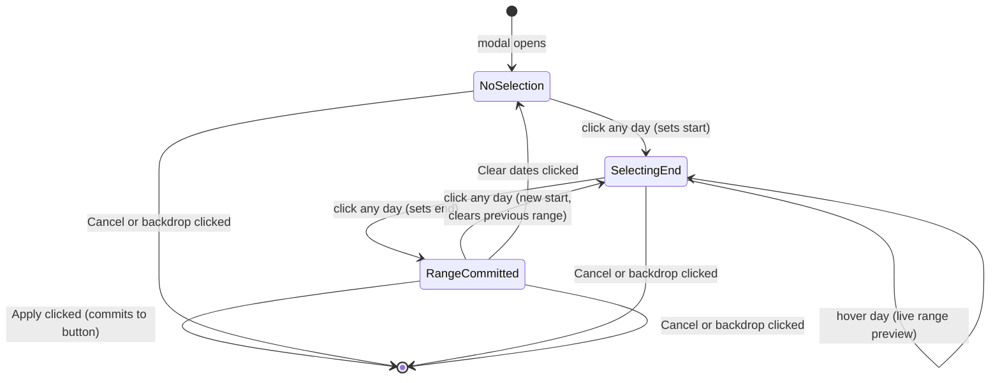

# Filter Bar and Date Picker

## Overview

The filter bar is a single card placed on the `/expenses` page between the balance card and the expense feed. It
consolidates what was previously two stacked cards (search bar card + filter bar card) into one unified component with
two rows.

**Page position:**

```text
Balance card
Filter bar card   ← this component
Expense feed
```

The filter bar owns three filters: free-text search, date range, and paid-by. All three are stateless from the server's
perspective — they drive HTMX query parameters that reload the expense feed partial. No page navigation occurs.

---

## Filter Bar Layout

Single `bg-white rounded-lg shadow-sm` card. Internal padding: `px-4 pt-3 pb-3`. Two rows separated by `space-y-2`.

### Row 1 — Search and Date

`flex items-stretch gap-2` — the search field stretches to fill all available space; the date button sits at a fixed
width on the right.

### Row 2 — Paid By and Clear All

`flex items-center justify-center gap-2 flex-wrap` — centred horizontally. Contains the paid-by label + select, the
"Clear all" link, and the transient "Filter applied" toast.

---

## Search Field

Full-width text input that occupies all horizontal space not taken by the date button (`flex-1`).

**Structure:** wrapper div with `flex items-center gap-2 border border-stone-300 rounded-lg bg-white px-3 flex-1` —
the focus ring is applied to the wrapper (`focus-within:ring-2 focus-within:ring-primary-600
focus-within:border-primary-600 transition-shadow`), not the input, so the entire field lights up on focus.

**Contents (left to right):**

- Magnifier icon: `w-4 h-4 text-stone-400 flex-shrink-0`
- `<input type="text">`: `flex-1 py-3 bg-transparent outline-none text-stone-900 placeholder-stone-400 text-sm`,
  `placeholder="Search expenses..."`, `id="search-input"`. The `py-3` padding gives vertical height that visually
  matches the date button.
- Clear (×) button: `text-stone-400 hover:text-stone-600`. Hidden (`hidden` class) when the field is empty; visible
  when the field contains text. Clicking it clears the field and triggers a feed reload.

**Behaviour:**

- Typing triggers a debounced HTMX reload of the expense feed after 300ms of inactivity.
- Pressing Enter triggers an immediate reload.
- Clicking × clears the field and triggers an immediate reload.

---

## Date Range Button

Positioned at the right end of Row 1 as a sibling of the search field wrapper.

**Base classes:** `flex items-center gap-2 px-3 border rounded-lg text-sm transition-colors whitespace-nowrap`

**Contents (left to right):**

- Calendar icon: `w-4 h-4 flex-shrink-0`
- Text block (`flex flex-col text-left leading-snug`):
  - Top line (`id="date-start"`): `text-xs font-medium` — shows start date or "All dates" when no range is selected
  - Bottom line (`id="date-end"`): `text-xs font-medium text-primary-500` — shows end date; empty when no range is
    selected
- Chevron-down icon: `w-3 h-3 text-primary-400 flex-shrink-0`

**States:**

| State | Classes on button |
| --- | --- |
| Inactive (no range selected) | `border-stone-300 text-stone-700` |
| Active (range selected) | `border-primary-500 bg-primary-50 text-primary-700` |

Inactive display: top line reads "All dates", bottom line is empty.

Active display: top line shows the start date, bottom line shows the end date in `text-primary-500` amber.

**Date format:** `DD Mon YYYY` — e.g. `01 Mar 2026`.

`id="date-picker-btn"`. Clicking the button opens the date picker modal.

---

## Paid By Filter

Row 2. Label + native `<select>`, centred with the rest of Row 2.

- Label: `text-sm font-medium text-stone-700 whitespace-nowrap` — text "Paid by"
- Select (`id="payer-select"`): `px-3 py-1.5 border border-stone-300 rounded-lg text-sm text-stone-700
  focus:ring-2 focus:ring-primary-600 focus:border-primary-600 outline-none cursor-pointer`
- Options: "All" (empty value), one option per household member

**Behaviour:** Filter applies immediately on `change` — no separate Apply button. After the value changes, a "Filter
applied ✓" toast (`id="paidby-toast"`) appears inline in Row 2 for 1500ms then hides. The toast is `text-xs
text-primary-600 font-medium`, hidden by default (`hidden` class toggled by JavaScript).

---

## Clear All

Plain text link in Row 2, to the right of the paid-by filter. Classes: `text-sm text-stone-500 hover:text-stone-700
hover:underline whitespace-nowrap`. Text: "Clear all".

Clicking it resets all three filters simultaneously:

1. Clears the search field (`id="search-input"` value → `""`)
2. Resets the paid-by select (`id="payer-select"` value → `""`)
3. Resets the date picker to the inactive state (top line → "All dates", bottom line → `""`, button classes → inactive)

After clearing, triggers a single HTMX reload of the expense feed.

---

## Date Picker Modal

### Trigger and Positioning

Opened by clicking `id="date-picker-btn"`. Rendered as a centred overlay.

**Backdrop:** `fixed inset-0 z-40`, `background: rgba(0,0,0,0.35)`. Clicking the backdrop dismisses the modal with no
changes (same effect as Cancel).

**Modal card:** `fixed z-50 bg-white rounded-2xl shadow-2xl overflow-hidden`, `width: 320px`, `top: 12%`, `left: 50%`,
`transform: translateX(-50%)`. Anchored from the top — modal grows downward only. The nav arrows never move when
switching months because the grid height is fixed (see Day Grid below).

---

### Modal Structure

The modal has four sections stacked vertically:

1. Navigation header (month select + year input + prev/next arrows)
2. Day-of-week header row
3. Day grid (always exactly 42 cells)
4. Footer (Clear dates + Cancel + Apply)

A hint line sits between the day grid and the footer.

---

### Navigation Header

`flex items-center justify-between px-4 py-3 border-b border-stone-100`

**Previous arrow** (`calPrev`): `p-1.5 hover:bg-stone-100 rounded-lg text-stone-500 hover:text-stone-700
transition-colors`. Navigates to the previous month. Wraps Jan → Dec (year − 1).

**Month select** (`id="cal-month-select"`): styled to appear as plain bold text with a small chevron rather than a
browser select control. Achieved with `appearance: none`, `background: transparent`, `border: none`, `outline: none`,
`font-weight: 600`, `font-size: 0.95rem`, and a custom SVG chevron set as `background-image`. Hover: color shifts to
`primary-600`. Changing the month jumps the calendar directly to the selected month without leaving the current year.

**Year input** (`id="cal-year-label"`): `<input type="number">`, `min="2000"` `max="2099"`, `width: 80px`. Styled as
plain text (`bg-transparent outline-none border-none text-center font-semibold`). Browser spin arrows provide year
increment/decrement. Typing a year and pressing Tab or Enter also updates the calendar.

**Next arrow** (`calNext`): mirror of the previous arrow button. Wraps Dec → Jan (year + 1).

---

### Day-of-Week Headers

`grid grid-cols-7 text-center px-3 pt-2 pb-1`

Seven cells: Mo Tu We Th Fr Sa Su — Monday-first.

- Monday through Friday: `text-xs font-medium text-stone-400`
- Saturday and Sunday: `text-xs font-medium text-stone-500` — one step darker to distinguish weekends

---

### Day Grid

`id="cal-grid"`, CSS:

```css
display: grid;
grid-template-columns: repeat(7, 1fr);
grid-template-rows: repeat(6, 36px);
```

The grid always renders exactly **42 cells** (6 rows × 7 columns). This is enforced by padding with out-of-month days:

- Cells before the 1st of the current month are filled with trailing days from the previous month.
- Cells after the last day of the current month are filled with leading days from the next month.
- The fill algorithm always produces exactly 42 cells regardless of month length or starting weekday.

The fixed `grid-template-rows: repeat(6, 36px)` means the grid height is always 216px. Navigation arrows do not shift
position when switching between months — this is intentional. It enables fast month navigation without needing to track
arrow movement.

**The `onmouseleave` handler is attached to the `#cal-grid` container div, not to individual cells.** Individual cells
are regenerated on every render (hover included), so attaching handlers to cells would cause a flicker loop: hover → re-
render → cell destroyed → re-render → etc. The container survives re-renders. An 80ms debounce timer (`_leaveTimer`)
on the grid's `mouseleave` prevents a false hover-clear when the mouse moves directly from one cell into an adjacent
cell (the brief gap between cells would otherwise fire the leave event).

**Cell rendering rules:**

| Condition | Cell appearance |
| --- | --- |
| Start or end of selected range | `bg-primary-600 text-white font-semibold` (filled amber circle) |
| Currently hovered while selecting | `bg-primary-600 text-white font-semibold` (same as start/end) |
| Strictly between start and range end/hover | `bg-primary-100` background on the cell wrapper |
| Today (current calendar date) | `ring-1 ring-stone-400 text-stone-700 hover:bg-stone-100` |
| Out-of-month padding day | `text-stone-300 hover:text-stone-500` (muted, still clickable) |
| Regular in-month day | `text-stone-700 hover:bg-stone-100` |

Out-of-month padding days are clickable. Clicking one navigates to that month and selects the day.

---

### Hint Line

`id="cal-hint"`, `text-xs text-stone-400 text-center px-4`, `min-height: 1.25rem`.

Displays context-sensitive guidance:

| Calendar state | Hint text |
| --- | --- |
| No start date selected | "Click to select a start date" |
| Start date selected, selecting end | "Click an end date" |
| Range fully committed | (empty) |

---

### Range Selection Interaction



**Step-by-step:**

1. Modal opens. State: `calStart = null`, `calEnd = null`, `calSelecting = false`. Hint: "Click to select a start date".
2. User clicks a day. That day becomes `calStart`. `calSelecting = true`. Hint: "Click an end date".
3. While `calSelecting = true`, hovering a day sets `calHover`. The grid re-renders with a live range preview:
   `calStart` shows filled amber circle; all days strictly between `calStart` and `calHover` get `bg-primary-100`;
   `calHover` shows filled amber circle.
4. User clicks a second day. That day becomes `calEnd`. `calSelecting = false`. If `calEnd < calStart`, they are
   automatically swapped so the earlier date is always the start. `calHover` is cleared.
5. User clicks Apply. `calStart` and `calEnd` are written to `#date-start` and `#date-end` in the date button. Date
   button switches to active styling. Modal closes. HTMX reloads the expense feed.
6. User clicks Cancel or backdrop instead. Modal closes. `calStart`, `calEnd`, and `calSelecting` revert to the last
   committed state (the values that were in effect when the modal opened).

If the user clicks Apply with only a start date and no end date, the end date defaults to the same day as the start
(single-day range).

---

### Modal Footer

`flex items-center justify-between px-4 py-3 border-t border-stone-100`

**Clear dates** (left): `text-sm text-stone-500 hover:text-stone-700 transition-colors`. Resets date selection
inside the modal (draft state only). `calStart`, `calEnd`, `calHover` are reset to `null`, `calSelecting = false`,
grid re-renders. The date button and filters remain unchanged until the user clicks Apply (which commits the cleared
state) or Cancel (which restores the pre-open committed state).

**Cancel** (right group): `px-3 py-1.5 text-sm border border-stone-300 rounded-lg hover:bg-stone-50
transition-colors`. Closes modal, discards uncommitted selection.

**Apply** (right group, rightmost): `px-3 py-1.5 text-sm bg-primary-600 text-white rounded-lg
hover:bg-primary-700 transition-colors`. Commits selection, updates date button, closes modal, triggers feed reload.

---

## Behaviour Reference

| Action | Result |
| --- | --- |
| Type in search field | Debounced live reload after 300ms |
| Press Enter in search field | Immediate reload |
| Click × in search field | Clears field, immediate reload |
| Click date range button | Opens date picker modal |
| Click modal backdrop | Closes modal, no change to filters |
| Click Cancel in modal | Closes modal, no change to filters |
| Click Apply in modal | Updates date button display, closes modal, triggers reload |
| Change Paid by select | Immediately triggers reload, shows 1.5s toast |
| Click Clear all | Resets all three filters simultaneously, triggers reload |
| Click Clear dates (in modal) | Resets date selection inside the modal (draft state only). Date button and filters unchanged until Apply or Cancel. |

---

## Visual Tokens Reference

| Token | Usage |
| --- | --- |
| `bg-primary-600` / `text-white` | Selected/hovered day pills, Apply button |
| `bg-primary-100` | Range-in-between day background |
| `bg-primary-50` / `border-primary-500` / `text-primary-700` | Active date button state |
| `text-primary-500` | End date line on date button |
| `text-primary-600` | "Filter applied ✓" toast text |
| `border-stone-300` / `text-stone-700` | Inactive date button, form borders |
| `text-stone-400` | Placeholder text, muted icons, weekday headers (Mon–Fri) |
| `text-stone-500` | Weekend headers (Sa, Su), secondary text |
| `text-stone-300` | Out-of-month padding days |
| `ring-1 ring-stone-400` | Today indicator |
| `shadow-2xl` | Modal card elevation |
| `rounded-2xl` | Modal card corners |
| `rounded-lg` | Filter bar card, inputs, buttons |

---

## Element ID Reference

| ID | Element |
| --- | --- |
| `search-input` | Search text input |
| `date-picker-btn` | Date range button (opens modal) |
| `date-start` | Top line of date button (start date or "All dates") |
| `date-end` | Bottom line of date button (end date) |
| `payer-select` | Paid by dropdown |
| `paidby-toast` | "Filter applied ✓" inline toast |
| `modal-backdrop` | Modal backdrop overlay |
| `date-picker-modal` | Modal card |
| `cal-month-select` | Month select inside modal |
| `cal-year-label` | Year number input inside modal |
| `cal-grid` | Day grid container |
| `cal-hint` | Hint text below day grid |
