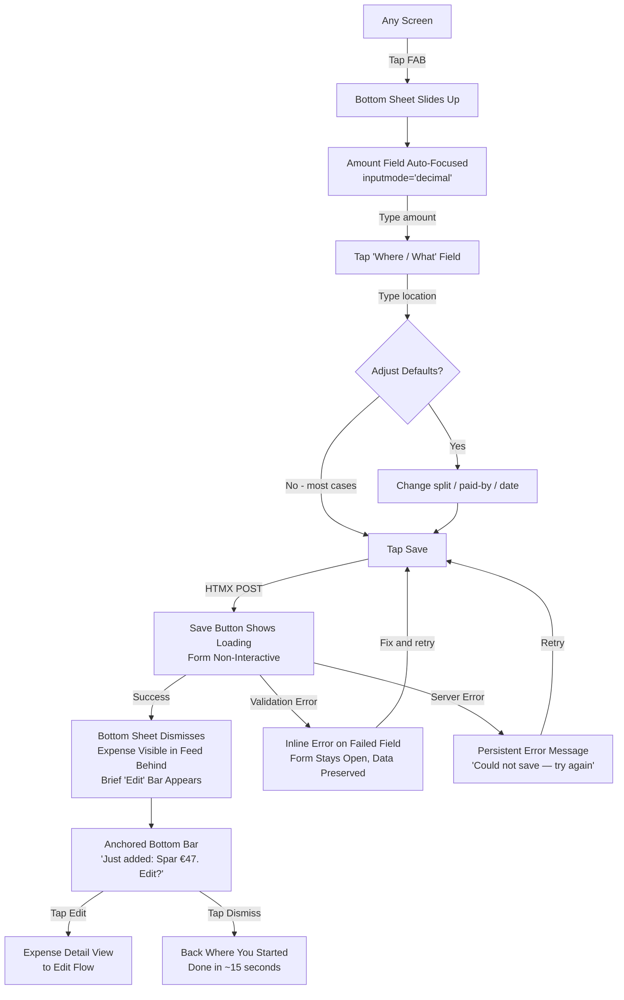
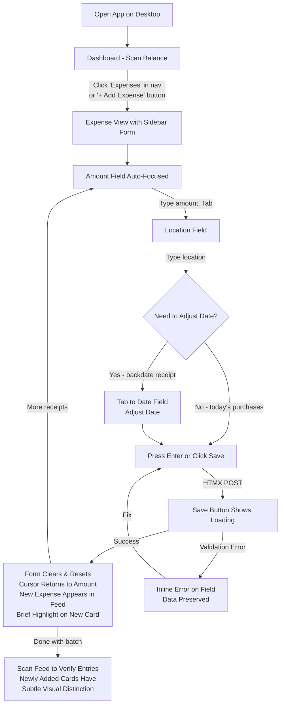
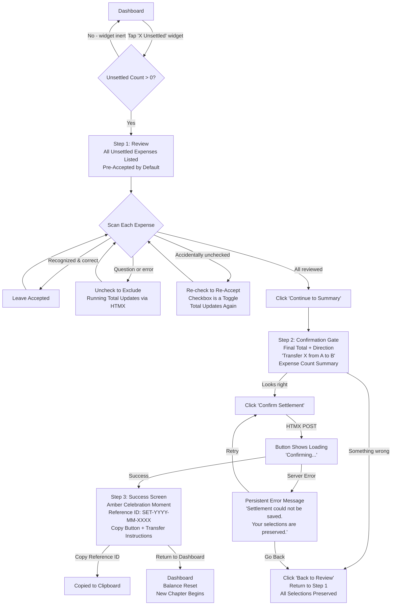
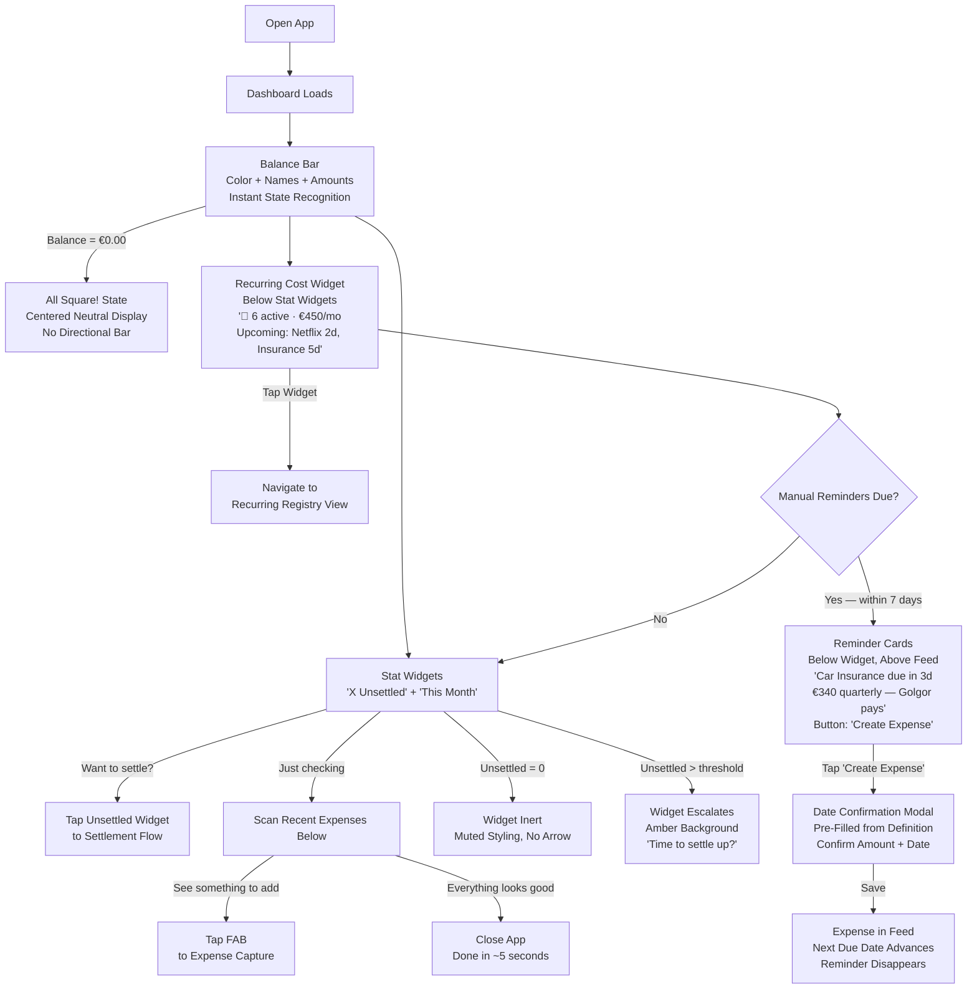
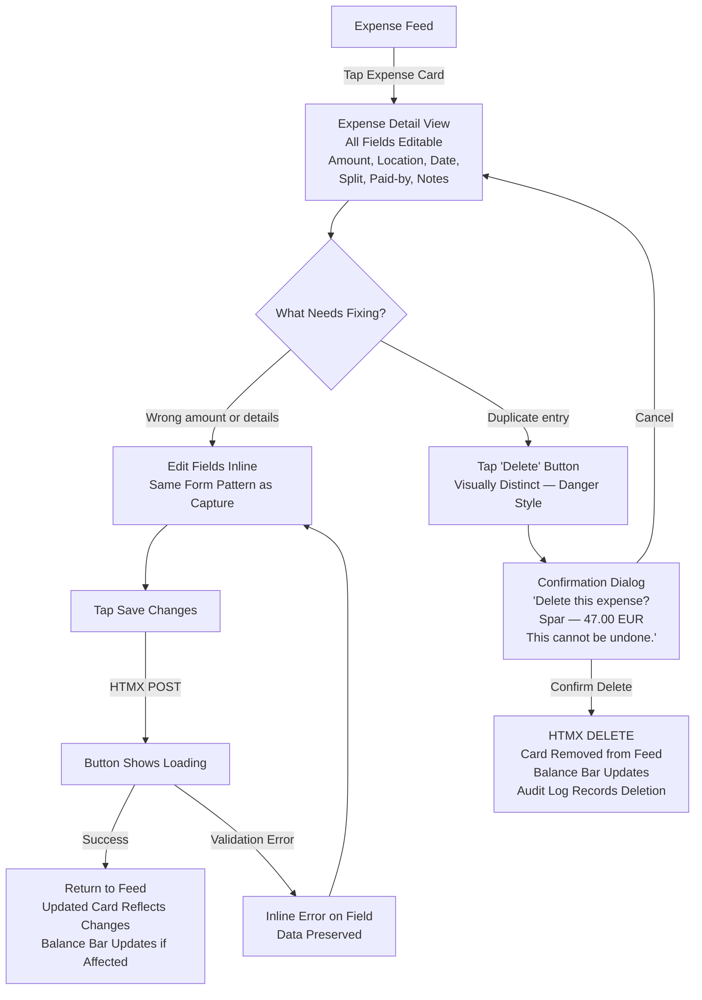
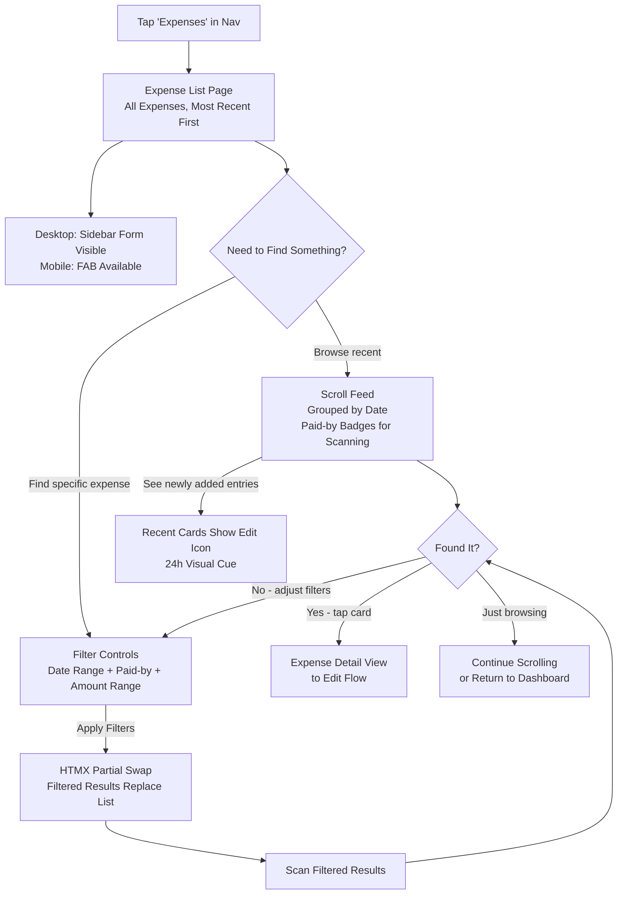
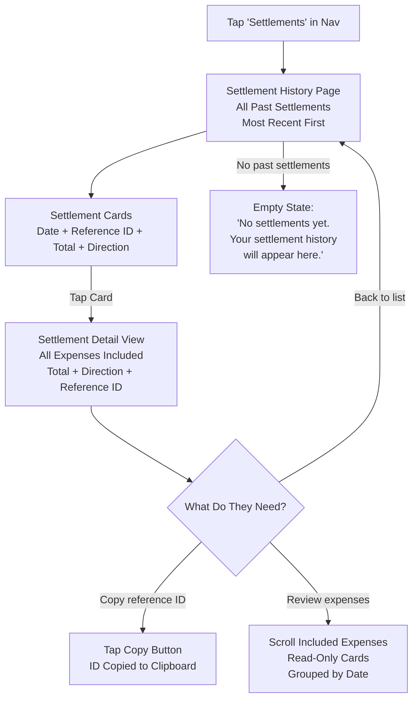
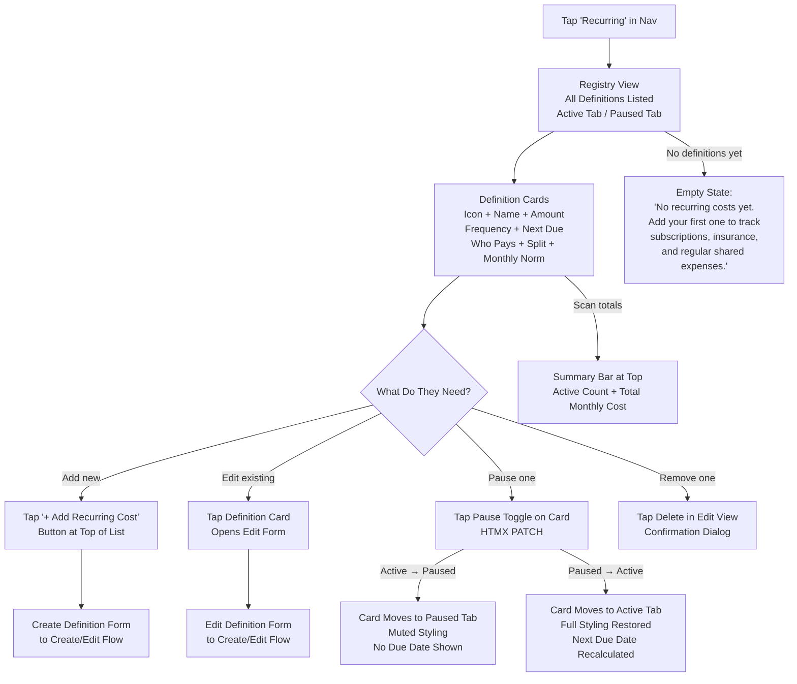
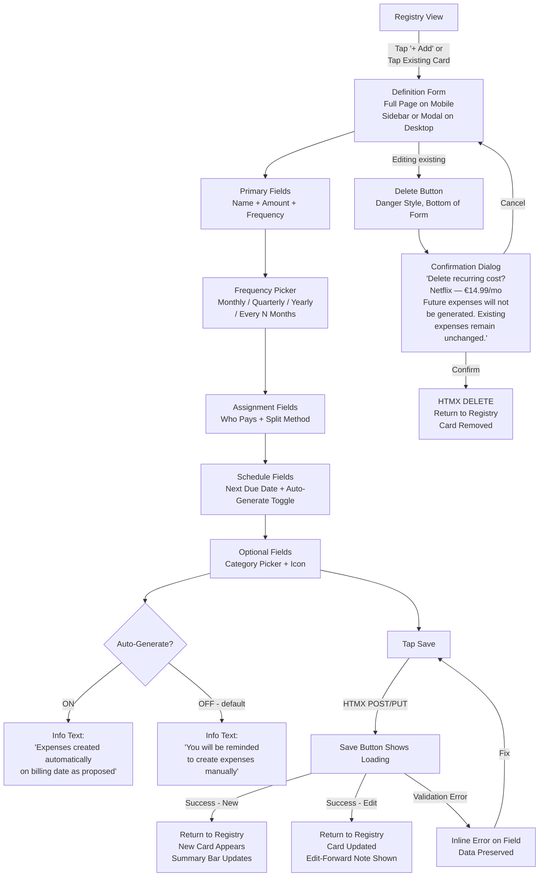
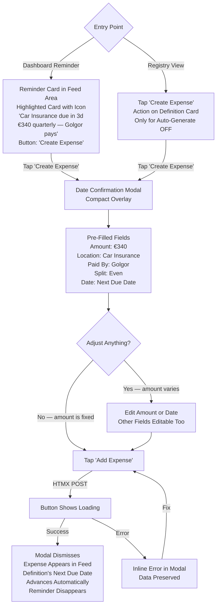

# User Journey Flows

## Quick Expense Capture (Mobile)

**Who:** Either user, on-the-go after a purchase
**Entry point:** FAB visible on any screen
**Goal:** Log an expense in under 30 seconds

**Key interaction details:**

- Amount field gets numeric keyboard immediately — no tap to select
- Smart defaults: split=even, paid-by=current user, date=today, currency=EUR
- "Where / What" label handles locations ("Spar"), services ("Netflix"), and descriptions ("birthday supplies")
- Bottom sheet keeps the feed partially visible — expense appearing behind it is the confirmation
- On error: inline message on the specific field, form stays open with all data intact — no re-entry
- **Post-save edit affordance:** After successful save, an anchored bottom bar appears: "Just added: [location]
  €[amount]. Edit?" This is not a floating toast — it's a fixed-position bar at the bottom of the viewport (above the
  mobile nav), consistent with the "no toasts" design rule. The bar persists until the user either taps "Edit"
  (navigates to detail view) or taps "Dismiss" (explicit close). This bridges the discoverability gap — users learn that
  expenses are editable without needing to discover the tap-to-edit pattern on their own.
- **HTMX loading pattern:** Save button shows spinner/loading state during round-trip, form inputs become
  non-interactive to prevent double submission. On success, bottom sheet dismisses via `hx-swap`. On failure, error
  message swaps into the form without disrupting user input.

---

## Batch Expense Entry (Desktop)

**Who:** Partner, Saturday morning with a pile of receipts
**Entry point:** Sidebar form (always visible on desktop expense view)
**Goal:** Enter 5-8 expenses rapidly with keyboard flow

**Key interaction details:**

- Sidebar form is always visible — no "open form" step needed
- Tab order: Amount → Location → Date → Split → Paid-by → Save. The first three cover 95% of cases
- "Save & Next" behavior: form clears, cursor returns to amount field — zero friction between entries
- Date picker is prominent (per PRD) — Partner frequently backdates receipts to actual purchase date
- Feed updates in real-time as each expense is saved — visual verification without navigating away
- Keyboard-driven: Enter to save, Tab to move between fields
- **Paid-by persistence:** During a batch session, the paid-by field retains its value from the previous entry (doesn't
  reset to current user). Partner often enters receipts from both users — setting paid-by once for a run of Golgor's
  receipts, then switching for her own, is more efficient than resetting each time
- **Newly added expenses get a brief visual cue** (e.g., subtle `primary-50` background that fades to white after a few
  seconds via CSS transition) — helps Partner verify "did that one go through?" during rapid entry and distinguish her
  new entries from existing ones when scanning the feed afterward
- **Edit discoverability:** Recently added expenses (last 24h) show a subtle edit icon on the card in the feed — signals
  that expenses are editable without requiring the user to discover tap-to-edit on their own. Icon fades after 24h to
  keep the feed clean for older entries

---

## Settlement Flow

**Who:** Both partners, co-located at desktop, Golgor drives
**Entry point:** Tappable "Unsettled" count widget on dashboard
**Goal:** Review month, confirm fair, get reference ID for bank transfer

**Key interaction details:**

- **Step 1 — Review:** Expenses grouped by week (collapsible sections), scannable at arm's length (Partner reads along).
  Each group has a "select all / deselect all" toggle for bulk actions. Pre-accepted by default (trust philosophy).
  **Checkboxes are toggles** — unchecking excludes, re-checking re-accepts. Both actions update the running total via
  HTMX partial swap. Both partners see the math change live. Progress indicator shows "Step 1 of 3." Grouping keeps the
  review manageable even with 60+ accumulated expenses — partners can collapse reviewed weeks and focus on the current
  one
- **Step 2 — Confirmation gate:** Read-only summary. Transfer direction in neutral language ("Transfer €127 from Partner
  to Golgor"). Back button returns to Step 1 with all selections preserved. One button to confirm.
- **Step 3 — Success:** Amber-themed celebration screen. Reference ID (`SET-2026-03-A7F2`) prominently displayed.
  One-click copy to clipboard with visual confirmation. Transfer instructions. This is the "chapter closed" moment —
  visually conclusive, emotionally satisfying
- Co-located design: text large enough for the non-driver to read, clear groupings, no hover-dependent interactions
- **HTMX loading pattern:** Each checkbox toggle fires an HTMX request to update the total — the total area shows a
  brief loading indicator. The "Confirm Settlement" button shows "Confirming..." during the POST. The success screen
  loads as a full page transition (not a partial swap) to mark the ceremonial shift.
- **Settlement error handling:** If the "Confirm Settlement" POST fails (network error, server error), a persistent
  error message appears: "Settlement could not be saved. Your selections are preserved." The user can retry or go back
  to review. No data is lost — all checkbox selections survive the error. This matches the error handling pattern used
  across all other flows.

---

## Dashboard Glance

**Who:** Either user, quick check-in
**Entry point:** Open app (dashboard is home screen)
**Goal:** Understand current state in under 5 seconds

**Key interaction details:**

- **Zero-balance state:** When balance is €0.00, the balance bar replaces the directional red/green display with a
  centered "All square!" message — no directional bar, just a celebratory neutral state. This avoids ambiguity about
  what an empty or half-half bar means
- No clicks needed to understand state — the balance bar communicates everything on load
- The dashboard is the context: users arrive informed, then decide what to do (or leave)
- **Settlement nudge:** When unsettled count exceeds a threshold (e.g., 30 expenses or 6+ weeks since last settlement),
  the unsettled widget visually escalates — amber background with "Time to settle up?" prompt. Not a notification, just
  a gentle visual shift within the existing dashboard. Still tappable, same destination
- Three possible next actions, all one tap: settle (unsettled widget), add expense (FAB), or browse (scroll)
- **"This Month" widget:** Displays the sum of all shared expenses in the current calendar month, both partners
  combined, regardless of settlement status. Not tappable — purely informational. Provides a household spending gut
  check ("are we spending roughly what we expect?"). No trend comparison in MVP; future analytics could add
  month-over-month context
- **Recurring cost widget** sits below the stat widgets as a compact summary card: "{N} active · €{total}/mo" on the
  first line, "Upcoming: {next 2-3 due cost names with days until due}" on the second. Tapping navigates to the full
  registry view. Empty state: "No recurring costs · Set up recurring costs to track your monthly baseline"
- **Reminder cards** appear below the widget and above the expense feed when manual-mode definitions (auto-generate OFF)
  are due within 7 days. Cards show the definition's icon, name, amount, frequency, who pays, and a prominent "Create
  Expense" button. Auto-generate definitions don't show reminders — their expenses appear directly in the feed
- **Date confirmation modal** from reminder cards is a compact overlay pre-filled with all definition metadata. For
  fixed costs it's a one-tap confirm; for variable costs the user adjusts the amount. After creation, the definition's
  next due date advances automatically and the reminder disappears
- The feed below the widgets scrolls naturally — no pagination, no "load more" for expected data volumes

---

## First Login

**Who:** Either partner
**Entry point:** OIDC login via Authentik
**Goal:** Log in and start using the app

**Key interaction details:**

- **Authentication is OIDC-based:** Users log in via redirect to Authentik (the identity provider). The app uses Authlib
  as the OIDC client library. There is no in-app login screen — login is a redirect to Authentik's hosted login page,
  and the app receives identity via OIDC claims on callback
- **User auto-provisioning:** On first OIDC login, the app creates a user record from OIDC claims (name, email, etc.).
  No manual user creation step — the identity provider is the source of truth for user identity. User limit is enforced
  via `MAX_USERS` setting (default 2)
- **First login lands on the expenses page** — no setup wizard, no onboarding steps. Household settings (currency,
  split type, threshold) are configured via environment variables
- **Empty state** is contextual and encouraging — "No shared expenses yet. Tap + to add your first one." Not a blank
  screen, but a clear invitation to start
- No email verification or password setup — Authentik handles authentication via OIDC. The app never sees or stores
  credentials

---

## Expense Edit/Correction

**Who:** Either user, correcting a mistake or removing a duplicate
**Entry point:** Tap/click an expense card in the feed
**Goal:** Fix an amount, update details, or delete a duplicate

**Key interaction details:**

- **Entry point is the expense card itself** — tapping/clicking opens an editable detail view. This resolves open design
  question about edit interaction model: detail page (not inline edit, not modal) works on both mobile and desktop
  without accidental edits
- Edit form uses the same field layout and styling as the capture form — familiar patterns, no new UI to learn
- Only unsettled expenses are editable — settled expenses are read-only (part of the historical record)
- **Delete requires explicit confirmation** with the expense details shown in the dialog — prevents accidental deletion.
  The confirmation shows the expense (location + amount) so the user is certain they're deleting the right one
- Delete is a danger action — button uses danger styling (not primary color), placed away from the save button
- Audit trail records who deleted what and when (per PRD Journey 3) — supports the "forgiveness over punishment"
  principle by making corrections transparent rather than hidden
- Balance bar and stat widgets update automatically after edit/delete (HTMX partial swap on the dashboard partials)

---

## Expense Browse & Filter

**Who:** Either user, reviewing history or verifying entries
**Entry point:** "Expenses" nav item (mobile bottom nav or desktop top nav)
**Goal:** Find, review, or verify specific expenses

**Key interaction details:**

- The expense list page is the **full history view** — all expenses, not just recent. This is where Partner goes to
  verify her Saturday batch entries during the week
- **Grouped by date** (day headers) with paid-by badges visible at scan speed — Partner can quickly verify "my entries
  from Saturday are all here"
- **Filter controls:** Collapsible filter bar at top — date range picker, paid-by toggle (Golgor / Partner / Both),
  optional amount range. Filters apply via HTMX partial swap (list updates without page reload)
- On desktop, the sidebar form is always present — browsing and adding coexist on the same screen
- On mobile, the FAB remains available — users can add while browsing
- **Keyword search:** A search input in the filter bar matches description and notes — same HTMX partial swap pattern as
  filters
- Cards are tappable to enter the edit/detail view — same pattern as dashboard feed

---

## Settlement History

**Who:** Either user, looking up past settlements
**Entry point:** "Settlements" nav item or link from settlement success screen
**Goal:** Find a past settlement's reference ID, review what was included, verify the record

**Key interaction details:**

- Settlement cards show the essential info at scan speed: date, reference ID, total amount, transfer direction ("Partner
  → Golgor, €127")
- Tapping a card opens the detail view — a read-only record of every expense included in that settlement, grouped by
  date
- **Reference ID is prominent and copyable** on both the list card and the detail view — this is the primary lookup
  reason (matching to bank transfers)
- All data is read-only — settlements are historical records, not editable
- **Empty state** for new users: encouraging, not blank
- **No pagination needed in MVP** — with monthly settlements, the list stays short. Infinite scroll is sufficient
- This page is the **audit trail** that PRD Journey 3 requires — Golgor can verify any past settlement's contents

---

## HTMX Interaction Pattern (Cross-Journey)

All journeys share a common HTMX interaction pattern for server round-trips:

1. **Initiation:** User clicks/taps an interactive element
2. **Loading:** The triggering element shows a loading state (`hx-indicator`). Form inputs become non-interactive during
   the request to prevent double submission. HTMX's `hx-disabled-elt` attribute handles this.
3. **Success:** The target element is swapped with the server response (150ms opacity transition via
   `htmx-swapping`/`htmx-settling` CSS classes). Self-confirming actions (new card in feed) need no additional feedback.
4. **Failure — Validation:** Server returns the form partial with inline error messages. The swap replaces the form
   content, preserving user input via server-side form re-rendering with submitted values.
5. **Failure — Server Error:** A persistent error message appears near the action button: "Something went wrong — try
   again." No toast, no auto-dismiss. The user must see it and can retry.

This pattern applies uniformly: expense capture, batch entry, settlement review toggles, edit/save, and delete.

## Journey Patterns

**Navigation Patterns:**

- **Action-from-anywhere:** FAB (mobile) and "+ Add Expense" button (desktop) are available on every screen. No
  navigate-to-act.
- **Dashboard-as-home:** Every session starts with context. Users arrive informed, decide action from there.
- **Widget-as-entry-point:** The unsettled count widget is a navigation element disguised as information — it provides
  data AND serves as the doorway to settlement.
- **Card-as-entry-point:** Expense cards are tappable to enter the edit/detail view — the data IS the navigation.

**Feedback Patterns:**

- **Self-confirming actions:** Expense appears in feed = confirmation. No extra banner needed.
- **Inline errors:** Validation failures show on the specific field, form preserves all data. Fix and retry, never
  re-enter.
- **Live-updating totals:** Settlement review total changes with each accept/discard — builds confidence through
  transparency.
- **Visual state changes:** HTMX swaps with 150ms opacity transition prevent flash, maintain continuity.
- **Loading indicators on the trigger:** The element the user clicked shows the loading state — not a global spinner.
  The user knows which action is in progress.
- **Newly added highlight:** Fresh expense cards get a brief `primary-50` background that fades to white — confirms
  "that one went through" during batch entry.

**Form Patterns:**

- **Smart defaults, override on exception:** Split, paid-by, date, currency all pre-filled. Users only touch what's
  different from the default.
- **Amount-first hierarchy:** Amount field always auto-focused, always the hero. Location is second. Everything else is
  tertiary.
- **Reset-and-ready:** After save, form clears and cursor returns to amount field. Ready for next entry without any
  navigation.
- **Consistent edit pattern:** The edit view uses the same field layout as capture — one form pattern to learn, used
  everywhere.

## Flow Optimization Principles

1. **Minimize steps to value:** Capture is 3 interactions (amount → location → save). Dashboard glance is 0 interactions
   (just look). Settlement happy path is 3 clicks (continue → confirm → copy).
2. **Reduce cognitive load at decision points:** Pre-accepted expenses mean the default is "do nothing." Smart form
   defaults mean the default is "just type amount and location." Users only think when something deviates.
3. **Provide feedback proportional to uncertainty:** Self-evident actions (new expense in feed) get no extra feedback.
   Uncertain actions (settlement confirmation, errors) get explicit, persistent feedback.
4. **Error recovery preserves context:** Every error state preserves user input. No form data lost on validation
   failure. Settlement review allows back-and-forth between review and confirmation. Edit/delete are always available
   for unsettled expenses.
5. **Co-located readability:** Settlement flow designed for two viewers — text sizes, groupings, and spacing support
   arm's-length reading. No hover-dependent information.
6. **Loading states are local, not global:** The element the user interacted with shows the loading indicator — no
   full-page spinners, no disorienting layout shifts. The rest of the page stays stable and readable.

**Noted for future scope (not in current flows):**

- **Data export:** CSV export for records. This will be a simple download action on the settlement history page — no
  complex flow needed, but it should be designed when settlement history UI is detailed.

---

## Recurring Cost Registry

**Who:** Either user, managing recurring shared costs
**Entry point:** "Recurring" nav item (mobile bottom nav or desktop top nav)
**Goal:** View, create, edit, pause, or remove recurring cost definitions

**Key interaction details:**

- **Card layout (Wallos-inspired):** Each definition card shows: optional category icon (left), name as bold primary
  text, amount + frequency as secondary ("€14.99 / monthly"), who pays (initials badge, same style as expense feed),
  split method label, next due date, and **normalized monthly cost** in a right-aligned accent column (e.g., yearly €600
  → "€50/mo"). The monthly normalization answers "what does this actually cost us per month?"
- **Two tabs: Active / Paused** — active tab is default. Paused tab shows definitions with muted styling (lower opacity,
  no due dates). Tab switching via HTMX partial swap
- **Summary bar** at the top of the active tab: "{N} active costs · €{total}/mo" — the total normalized monthly cost
  across all active definitions. This is the recurring baseline figure referenced in the PRD success criteria
- **Pause toggle** directly on the card — a small toggle switch or icon button. Tapping fires an HTMX PATCH request and
  the card animates to the other tab. No confirmation dialog for pause/reactivate — low-risk, easily reversible
- **Sort order:** Active definitions sorted by next due date (soonest first) — the ones you need to deal with next are
  at the top
- **Empty state** follows the existing pattern — contextual guidance with a clear invitation to add the first definition
- **Auto-generate indicator:** Cards with auto-generate ON show a small "auto" badge or icon, distinguishing them from
  manual-mode definitions at scan speed
- **"Create Expense" action** available on manual-mode definition cards — a secondary button for pre-creating expenses
  before the reminder window (e.g., bill arrived early)

---

## Create/Edit Recurring Cost Definition

**Who:** Either user, setting up or modifying a recurring cost
**Entry point:** "+ Add Recurring Cost" button or tap existing definition card
**Goal:** Define or update a recurring cost with all metadata

**Key interaction details:**

- **Form layout** follows the existing capture form pattern with **progressive disclosure** to manage the 9-field
  complexity. Primary fields (name, amount, frequency, who pays, split method) are always visible. Schedule fields (next
  due date, auto-generate toggle) sit below a clear visual separator. Optional fields (category, icon) are behind a
  "More options" toggle. This mirrors the expense capture form's hierarchy and keeps the form from feeling overwhelming
  despite the field count (see Open Design Question #13)
- **Field hierarchy:**
  1. **Name** (text, required) — "Netflix," "Car Insurance," "Daycare." Placeholder: "What recurring cost?"
  2. **Amount** (decimal, required) — same numeric input pattern as expense capture (`inputmode='decimal'`)
  3. **Frequency** (selector, required) — four options: Monthly, Quarterly, Yearly, Every N Months. Selecting "Every N
     Months" reveals an additional numeric input for the interval
  4. **Who Pays** (toggle, required) — Golgor / Partner selector, same UI as expense form paid-by
  5. **Split Method** (selector, required) — Even / Shares / Percentage / Amount, same options as expense split modes,
     defaults to Even
  6. **Next Due Date** (date picker, required) — when this cost next bills. Calendar widget consistent with expense date
     picker
  7. **Auto-Generate** (toggle, default OFF) — contextual info text below explains the behavior for each state
  8. **Category** (optional) — dropdown or chip selector from a preset list (Subscription, Insurance, Childcare,
     Utilities, Membership, Other)
  9. **Icon** (optional) — small icon picker or emoji selector for visual identification in the registry
- **Auto-generate toggle** shows contextual helper text: ON → "Expenses created automatically on billing date as
  proposed"; OFF → "You'll be reminded to create expenses manually when due"
- **Edit-forward semantics** — when editing an existing definition, a subtle info banner appears: "Changes apply to
  future expenses only. Existing expenses in the feed are unchanged." Sets expectations clearly
- **Delete confirmation** follows the existing delete pattern — shows the definition name and amount, explains the
  consequence. Existing generated expenses remain in the feed untouched
- **Desktop:** Form appears in a sidebar panel or modal overlay (consistent with how desktop captures work alongside the
  feed). **Mobile:** Full-page form (consistent with mobile edit patterns)

---

## Manual Expense Creation from Recurring Cost

**Who:** Either user, creating an expense from a manual-mode recurring cost
**Entry point:** Dashboard reminder card or "Create Expense" action in registry
**Goal:** Confirm and create an expense from a recurring cost definition with minimal effort

**Key interaction details:**

- **Dashboard reminder cards** appear when a manual-mode definition (auto-generate OFF) is within 7 days of its next due
  date. Cards are visually distinct — highlighted border or background using `primary-50`, with the definition's icon,
  name, amount, frequency, who pays, and a prominent "Create Expense" button
- **Date confirmation modal** is a compact overlay (not a full form) — all definition metadata pre-fills the expense.
  The user's primary decision is: "Is this the right amount and date?" For fixed costs it's a one-tap confirm; for
  variable costs the user adjusts the amount
- **All inheritable metadata pre-filled:** amount, name (as location/description), who pays, split method, category,
  icon. Date defaults to the definition's next due date but is editable
- **After successful creation:** The definition's next due date advances automatically to the next billing cycle
  (monthly → +1 month, quarterly → +3 months, yearly → +12 months, every N months → +N months). The reminder card
  disappears. The new expense appears in the feed as a normal "proposed" expense with a recurring cost indicator
- **Registry "Create Expense" action** — on manual-mode definitions in the registry view, a secondary action button is
  available directly on the card. Useful for pre-creating expenses before the reminder window (e.g., the bill arrived
  early)
- **Settlement integration:** All created expenses (both auto-generated and manually confirmed) enter the feed as
  standard "proposed" expenses and flow through the normal settlement review. Auto-generation saves entry effort, not
  review effort — the trust loop is preserved

---

## Recurring Cost Indicator in Expense Feed

Expenses generated from recurring cost definitions (both auto-generated and manually created) carry a visual indicator
in the feed:

- A small recurring icon (🔄 or a loop/refresh icon) appears on the expense card, next to the status badge area
- Below the icon: the definition name as a tappable link in `text-xs` muted text (e.g., "from Netflix")
- Tapping the link navigates to the definition in the recurring registry view
- The indicator is purely informational — it doesn't change how the expense behaves in the feed or settlement review
- If the source definition is deleted, the indicator shows the name but the link becomes inert
- During settlement review, the indicator helps partners distinguish one-off expenses from recurring ones at a glance —
  "yes, that's our Netflix, same as every month"

---

## Navigation Structure

**Mobile bottom nav (4 items + FAB):**

1. Dashboard (home icon)
2. Expenses (list icon)
3. Recurring (refresh/loop icon)
4. Settlements (checkmark icon)
5. FAB (center, elevated above the nav bar — Material Design pattern, overlapping the nav edge by ~50%. Not inline with
   nav items. See Open Design Question #12 for crowding concerns on smaller phones)

**Desktop top nav:**

- Logo placeholder (left)
- Dashboard | Expenses | Recurring | Settlements (center-left)
- "+ Add Expense" button (right)
- Authenticated user's name/initials badge (far-right, from OIDC session — confirms who is logged in, with a dropdown
  for logout)

---

## Recurring Cost Reusable Partials

Additional Jinja2 partials for the recurring cost engine:

| Partial | Purpose | Used In |
| --- | --- | --- |
| `_recurring_card.html` | Definition card — icon, name, amount, frequency, who pays, split, normalized monthly cost, pause toggle, auto-generate badge | Registry view |
| `_recurring_form.html` | Create/edit form — all definition fields with frequency picker and auto-generate toggle | Registry create/edit |
| `_recurring_widget.html` | Dashboard summary — active count, monthly total, upcoming due dates | Dashboard |
| `_reminder_card.html` | Due-soon reminder — highlighted card with definition details and "Create Expense" action | Dashboard (above feed) |
| `_date_confirm_modal.html` | Compact modal for manual expense creation — pre-filled fields, date picker, confirm button | Dashboard reminders, registry |
| `_recurring_indicator.html` | Small icon + definition link on expense cards | Expense feed, settlement review |
