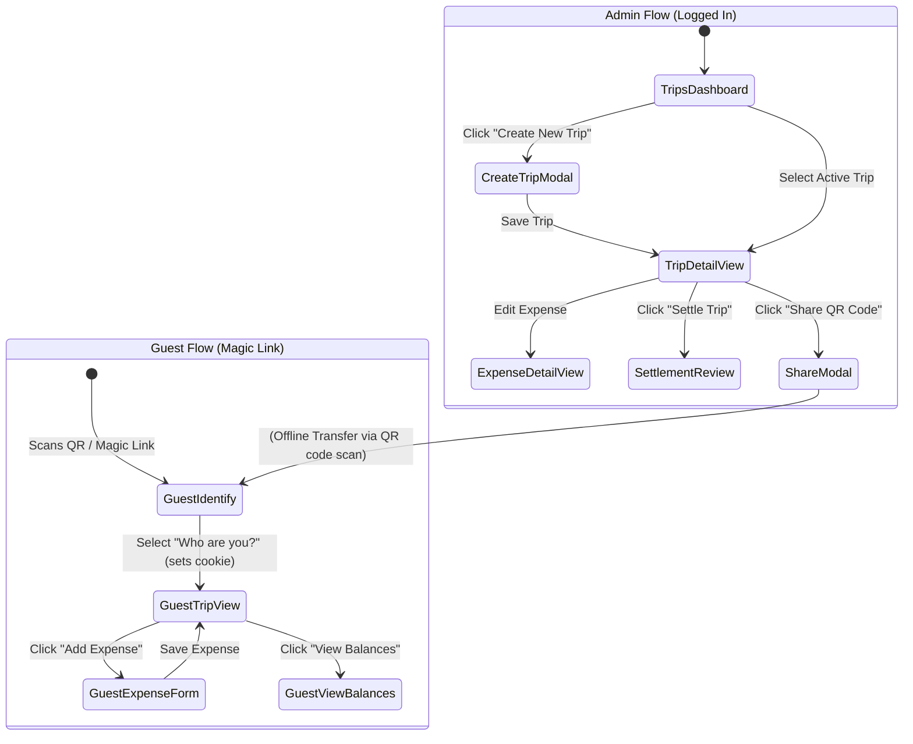
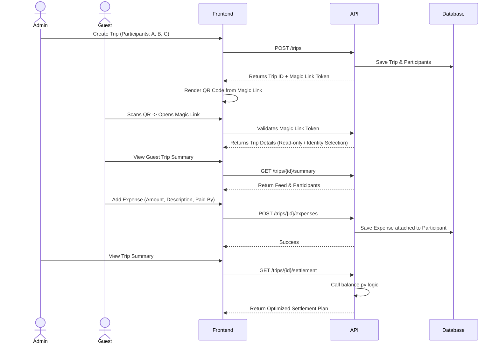

# Feature Specification: Trips (Event Splitting with Guest Access)

This document outlines the product requirements and high-level technical flow for the new **Trips** feature (originally conceptualized as MVP2 in the PRD). 

The goal is to extend Cost Tracker beyond just the two-person household by allowing Admins to create temporary groupings ("Trips") to track shared expenses with friends, without requiring guests to create user accounts.

## 1. Feature Overview

We want to replace the "bowl full of receipts" at the end of a group trip. 
- **Admins** (the core household users) create a "Trip," defining its name, currency, and participant names.
- **Guests** access the trip via a magic link or QR code scanned from an Admin's phone.
- Guests do not log in. Their access is tightly scoped to adding and viewing expenses for that specific trip.
- At the end of the trip, the system calculates the most efficient way to settle all balances (minimizing transaction counts) among participants.

## 2. User Journeys

### Journey A: The Admin Experience
1. **Creation**: An Admin navigates to the "Trips" tab and creates a new trip: "Summer Cabin 2026." They select participants from their **global guest address book** (e.g., Alice, Charlie) and can create a new guest inline (e.g., Bob) if they haven't traveled with them before.
2. **Onboarding Guests**: The Admin opens the trip details on their phone, revealing a shared QR code. Alice and Bob scan it.
3. **Management**: Admins can edit/delete any expense, add their own expenses, and eventually mark the trip as "Settled," locking it.
4. **Historical Access**: Admins can always review past trips and the settlements on the Trips dashboard.

### Journey B: The Guest Experience
1. **Access**: Alice scans the QR code. She lands on an identity selection screen that lists the trip's participants.
2. **Identity Assignment**: Alice selects "I am Alice." The system saves this in a multi-trip session cookie. A small "Not Alice? Change identity" link appears in the header for corrections.
3. **Engagement**: She drops into the isolated "Trip Summary" feed. She taps "Add Expense," enters "Groceries - 120 EUR," and it saves to her identity.
4. **Settlement**: At the end of the trip, Alice checks the link and sees clear, optimized instructions: "Alice pays Bob 30 EUR."

## 3. User Flows & Mockups

### Flow Map

Mapping out the relationship between views for Admins vs. Guests. It is crucial to understand the separation in their journeys.

### Mockups

Below are basic Excalidraw-style mockups showing the critical views for Admins and Guests.

**Admin: Trips Dashboard**

**Guest: Trip Summary View (Landing Page)**

**Guest: Add Expense Screen**

## 3. High-Level Architecture & Interaction Sequence

To make this reviewable by our **Architecture** and **Dev** team members, here is the suggested conceptual sequence.

## 4. Open Questions & Delegation To The Team

As a PM, I want to make sure we don't over-engineer this, but getting it right is crucial. Here is what I am asking our team to decide on:

> [!WARNING]
> **For the Architecture Team: Guest Identity Management** 
> How should user identification be handled for Guests? 
> - **Option A:** One identical Magic Link for everyone. A Guest lands on the page, selects their name from a dropdown ("I am Alice") once, and it is saved in a session cookie.
> - **Option B:** Unique Magic Links generated for each person (harder to share quickly IRL via QR).
> - **Option C:** A dropdown on the "Add Expense" form where they just pick their name *every time* they add an expense (most simple, least secure against mistakes).
> 
> *Which approach provides the best balance of friction-less UX vs data integrity? Are there other viable solutions?*

> [!TIP]
> **[RESOLVED] For the Dev Team: Settlement Logic** 
> *Assessment Complete:* The `balance.py` domain logic natively supports Trip Participants without any refactoring. 
> The Trip Settlement Use Case will construct pseudo-`ExpensePublic` objects (or use Duck Typing) where `payer_id` is populated with the `trip_participants.id`. The engine's output (`user_id`, `from_user_id`, `to_user_id`) will be mapped back to `trip_participants.id`s by the calling service layer.

> [!NOTE]
> **For the UX Team: Integration and Mobile-First Layout** 
> - Review the mockups and flow diagram above. 
> - Ensure the Guest screens are heavily optimized for mobile—big buttons, clear inputs, no clutter. 
> - For Admins, how do we distinguish "Household Expenses" on the main dashboard from "Trips" without confusing navigation? Is a simple top-level tab enough?

## 5. Architectural Decision: Guest Identity & Data Modeling

As the Architecture Lead, I have reviewed the requirements for Guest Identity Management. Here are the technical decisions to support the Trips MVP.

### 5.1 Guest Identity Management Decision

**Selected Approach:** **Option A (Shared Magic Link + Cookie State)**

**Rationale:**
- **Frictionless UX:** For IRL (in-real-life) sharing, a single QR code that everyone can scan is vastly superior to sending unique links to each person manually.
- **Sufficient Security:** Cost Tracker is a low-stakes environment among friends. The "sharing token" acts as a capability URL (a long, unguessable cryptographic token). Once they have the link, they are authorized for that trip. If someone accidentally clicks the wrong name, it's a social error, easily correctable, not a strict security boundary breach.

**Implementation Details & Edge Cases:**
- **The Magic Link:** Looks like `/t/{sharing_token}`.
- **The Cookie Structure (Multi-Trip Support):** Instead of creating a new cookie for every trip (which could pollute the browser over time), we will use a **single signed cookie** named `costtracker_guest_session`. The payload will contain a dictionary mapping Trip IDs to Participant IDs: `{"trips": {123: 45, 124: 78}}`. This ensures a user can be active in multiple trips simultaneously without cookies overwriting each other.
- **Cookie Validity:** The cookie can have a long expiration (e.g., 60 days) or be virtually indefinite relative to the trip. Access is ultimately bounded by the trip's `is_active` status. Once an admin closes/settles a trip, the guest cookie simply stops granting write access regardless of its expiration date.
- **Correcting Mistakes (Wrong Name):** If a user selects the wrong name, rescanning the QR code won't help (since they are already recognized by the cookie). The Guest UI must explicitly include a **"Not [Name]? Change identity"** button/link on the trip's feed page. Clicking this will clear their identity for that specific trip and return them to the "Who are you?" selection screen.
- **Admin Handling:** Core household Admins will bypass the name selector. Their OIDC session implies their `user_id`, which we look up in the `trip_participants` table to automatically map their identity for the trip.

### 5.2 Schema Changes & Data Modeling

To avoid polluting the core 2-person household `expenses` table, we will create isolated tables for Trips. This aligns with our Hexagonal Architecture, keeping Trip logic separate while allowing us to reuse pure domain logic (like `balance.py`).

**1. `trips` Table**
- `id`: Integer (PK)
- `name`: String (Required)
- `currency`: String (Required)
- `sharing_token`: String (Required, Indexed, Unique) - e.g., URL-safe UUIDv4 (the "magic" part)
- `is_active`: Boolean (Default: True) - For closing/archiving a trip
- `created_at`: TIMESTAMPTZ (server_default)
- `updated_at`: TIMESTAMPTZ (server_default, onupdate)
- `created_by_id`: Integer (FK to `users.id`)

**2. `guests` Table (Global Address Book)**
- `id`: Integer (PK)
- `name`: String (Required, Unique)
- `user_id`: Integer (FK to `users.id`, Nullable) - Maps an authenticated household Admin to their global guest record.

**3. `trip_participants` Table (Many-to-Many Mapping)**
- `trip_id`: Integer (FK to `trips.id`, ON DELETE CASCADE)
- `guest_id`: Integer (FK to `guests.id`, ON DELETE CASCADE)
- **Primary Key:** `(trip_id, guest_id)`

> [!NOTE]
> **Admin Pattern: Global Address Book**
> Based on PM feedback, the system will use a global address book for guests. Since the app is only used among a close-knit group (10-15 people), admins will create a guest globally once (e.g., "Charlie"). 
> - **Creation UX:** When creating or editing a trip, the Admin will see a dropdown/checkbox list of all known global guests and can select who is attending. There will also be a small "Create New Guest" button inline if a new person joins the group.
> - **Multi-Trip Support:** This ensures "Charlie" is the same entity across all trips, making identity management easier.

**4. `trip_expenses` Table**
- `id`: Integer (PK)
- `trip_id`: Integer (FK to `trips.id`, ON DELETE CASCADE)
- `description`: String (Required)
- `amount`: Numeric/Decimal (Required)
- `date`: Date (Required)
- `paid_by_id`: Integer (FK to `guests.id`) - Who paid for the expense
- `created_at`: TIMESTAMPTZ (server_default)
- `updated_at`: TIMESTAMPTZ (server_default, onupdate)
- `created_by_guest_id`: Integer (FK to `guests.id`) - The guest who actually entered the expense (for audit logs)

**5. Reusing `balance.py` (API Interface Mapping)**
- The `balance.py` functions natively operate on generic integer IDs and have zero ORM or framework dependencies.
- **Input Mapping:** The API Use Case will fetch `TripExpense` records and adapt them to match the shape `balance.py` expects (e.g., mapping `paid_by_id` into `payer_id`). The global `guests.id`s will be passed directly into the `member_ids` argument.
- **Output Mapping:** The Use Case will receive the optimized `MemberBalance` and `SettlementTransaction` objects (which will contain `guests.id`s stored in their `user_id` fields) and map them to the guest display names for the frontend to render.

## 6. Next Steps

With these updates and mockups incorporated, we have a clear, graphical map of the user flow and a finalized technical architecture. 

Once these design decisions are validated by the PM, we can proceed to Execution:
1. Generate Alembic migrations for the new tables.
2. Implement `TripPort` and `SqlAlchemyTripAdapter`.
3. Build the core Use Cases (create trip, add participant, save expense).
4. Implement the Guest Authentication middleware (Shared Link + Signed Cookie).
5. Wire up the Route Handlers and HTMX Templates.
